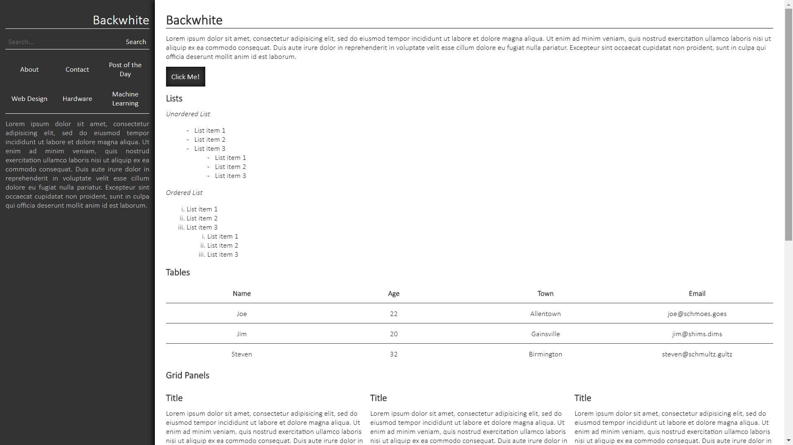
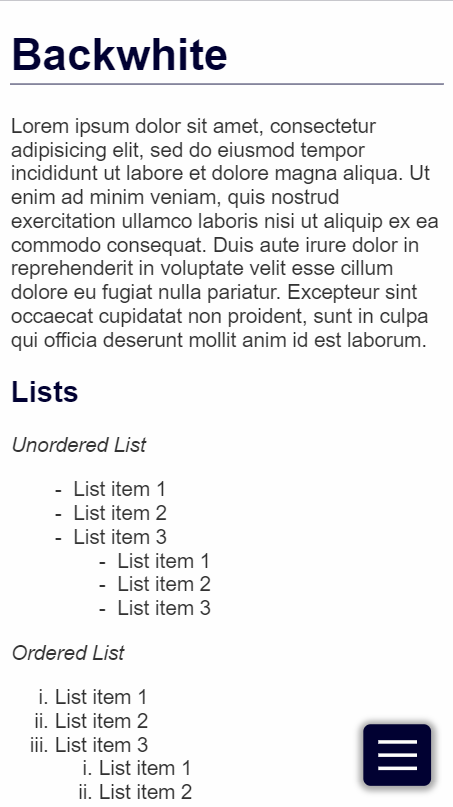
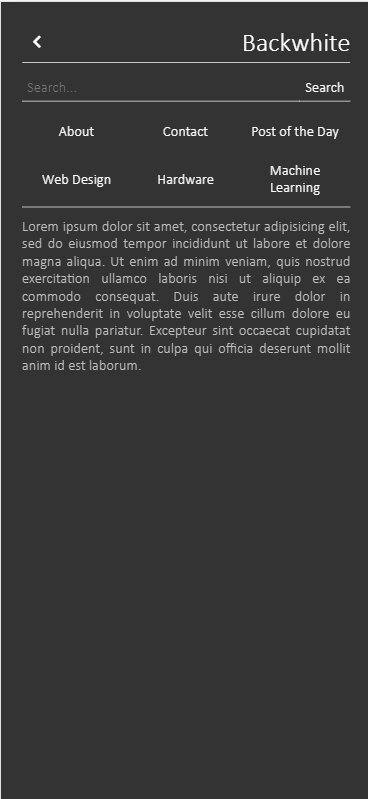

# Backwhite

Simple sophisticated styling for blogs and other content-based sites.

_Desktop View_



_Mobile Page_



_Mobile Menu_



## Installation

Just type `npm install backwhite --save` in your node project

## Usage

### Back and Front Panels

The core of this design is the back panel (appearing on the right on desktop, and appearing behind on mobile), and the front panel.

These panels are created with `<div class='bw-back'>` and `<div class='bw-front>` respectively.

```html
<div class='bw-back'>
    <!-- ... menu -->
</div>
<div class='bw-front'>
    <!-- ... content -->
</div>
```

### Headers

Both on the back and the front panel in the example have headers at the top. Headers have a title and a series of actions (usually icon buttons). The order of the html controls the order of the elements.

Backwhite comes with fontawesome solid and brand icons. Use them just like you would in any other app.

```html
<div class='bw-header'>
    <h1 class='bw-title'>Hello World</h1>
    <button class='bw-action'>
        <span class='fas fa-check'></span>
    </button>
    <button class="bw-action">
        <span class="fas fa-times"></span>
    </button>
</div>
```

_More content will be added soon_