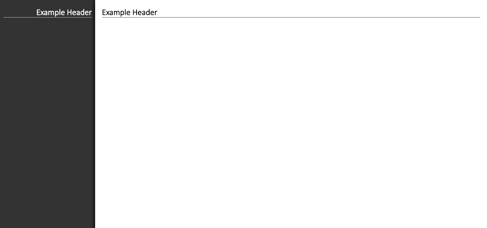

# Backwhite

Simple sophisticated styling for blogs and other content-based sites.

_Desktop View_


_Mobile Page_


_Mobile Menu_


## Installation

Just type `npm install backwhite --save` in your node project

## Usage

### Back and Front Panels

The core of this design is the back panel (appearing on the right on desktop, and appearing behind on mobile), and the front panel.

These panels are created with `<div class='bw-back'>` and `<div class='bw-front>` respectively.

```html
<body>
    <div class='bw-back'>
        <p>Back (menu)</p>
    </div>
    <div class='bw-front'>
        <p>Front (content)</p>
    </div>
</body>
```


Wrap all the content in these panels with their appropriate containers to provide spacing.

```html
<body>
    <div class='bw-back'>
        <div class='bw-back-container'>
            <p>Back (menu)</p>
        </div>
    </div>
    <div class='bw-front'>
        <div class='bw-front-container'>
            <p>Front (content)</p>
        </div>
    </div>
</body>
```


### Headers

Both the back and the front panel in the example have headers at the top. Headers have a title and a series of actions (usually icon buttons).

Backwhite comes with fontawesome solid and brand icons. Use them just like you would in any other app.

This is an example of a header in the front panel.

```html
<div class='bw-header'>
    <h1 class='bw-title'>Example Header</h1>
    <button class='bw-action'>
        <span class='fas fa-check'></span>
    </button>
    <button class="bw-action">
        <span class="fas fa-times"></span>
    </button>
</div>
```


This is an example of a header in the back panel.

```html
<div class='bw-header'>
    <button class="bw-action">
        <span class="fas fa-times"></span>
    </button>
    <button class='bw-action'>
        <span class='fas fa-check'></span>
    </button>
    <h1 class='bw-title'>Example Header</h1>
</div>
```


_More content will be added below soon_

### Controlling Mobile Sliding

The front and back usually start with main headers. These are what will contain the buttons controlling the sliding on mobile. The front panel header would usually contain the title of the page. The back panel header would contain the title of the site. On each of these there would be one button which handles opening and closing.

```html
<body>
    <div class="bw-back">
        <div class="bw-back-container">
            <div class='bw-header'>
                <button class="bw-action bw-show-on-mobile bw-close">
                    <span class="fas fa-chevron-left"></span>
                </button>
                <h1 class='bw-title'>Example Header</h1>
            </div>
        </div>
    </div>
    <div class="bw-front">
        <div class="bw-front-container">
            <div class='bw-header'>
                <h1 class='bw-title'>Example Header</h1>
                <button class="bw-action bw-show-on-mobile bw-open">
                    <span class="fas fa-chevron-right"></span>
                </button>
            </div>
        </div>
    </div>
</body>
```

_Desktop_



_Mobile Page_


_Mobile Menu_


`.bw-show-on-mobile` will hide the button on desktop and show it on mobile. `.bw-open` and `.bw-close` are preprogrammed classes which trigger the opening and closing of the menu respectively when clicked. Font awesone's chevron icons are being used here.

### Back Menu Links

Links are organized on the back menu using a table.

```html
<table class="bw-links">
    <tr>
        <td><a href='#'>About</a></td>
        <td><a href='#'>Contact</a></td>
        <td><a href='#'>Post of the Day</a></td>
    </tr>
    <tr>
        <td><a href='#'>Web Design</a></td>
        <td><a href='#'>Hardware</a></td>
        <td><a href='#'>Machine Learning</a></td>
    </tr>
    <tr>
        <td>
            <a href="#">
                <span class="fab fa-youtube"></span> Youtube
            </a>
        </td>
        <td>
            <a href="#">
                <span class="fab fa-github"></span> Github
            </a>
        </td>
        <td>
            <a href="#">
                <span class="fab fa-linkedin"></span> Linkedin
            </a>
        </td>
    </tr>
</table>
```


### Back Menu Footer

The footer goes in the back menu within a div with the class `.bw-footer`.

```html
<div class="bw-footer">
    <p>Lorem ipsum dolor sit amet, consectetur adipisicing elit, sed do 
        eiusmod tempor incididunt ut labore et dolore magna aliqua. 
        Ut enim ad minim veniam, quis nostrud exercitation ullamco 
        laboris nisi ut aliquip ex ea commodo consequat. 
        Duis aute irure dolor in reprehenderit in voluptate 
        velit esse cillum dolore eu fugiat nulla pariatur. 
        Excepteur sint occaecat cupidatat non proident, sunt in 
        culpa qui officia deserunt mollit anim id est laborum.</p>
</div>
```


### Responsive Tables

Tables are scaled so that every cell is as wide as the widest text cell. This means that the tables will overflow over the edge. In backwhite, these tables are wrapped in a horizontal scroll wrapper div to allow for horizontal scrolling between tables.

```html
<div class='bw-horiz-scroll-wrapper'>
    <table>
        <thead>
            <tr>
                <th>Name</th>
                <th>Age</th>
                <th>Town</th>
                <th>Email</th>
            </tr>
        </thead>
        <tbody>
            <tr>
                <td>Joe</td>
                <td>22</td>
                <td>Allentown</td>
                <td>joe@schmoes.goes</td>
            </tr>
            <tr>
                <td>Jim</td>
                <td>20</td>
                <td>Gainsville</td>
                <td>jim@shims.dims</td>
            </tr>
            <tr>
                <td>Steven</td>
                <td>32</td>
                <td>Birmington</td>
                <td>steven@schmultz.gultz</td>
            </tr>
        </tbody>
    </table>
</div>
```


### Cutouts

### Buttons

### Forms

#### Block Forms

#### Cutout Forms

#### Inline Forms

### Customization

#### Colors

#### Spacing

#### Font Scales

#### Controlling Responsiveness