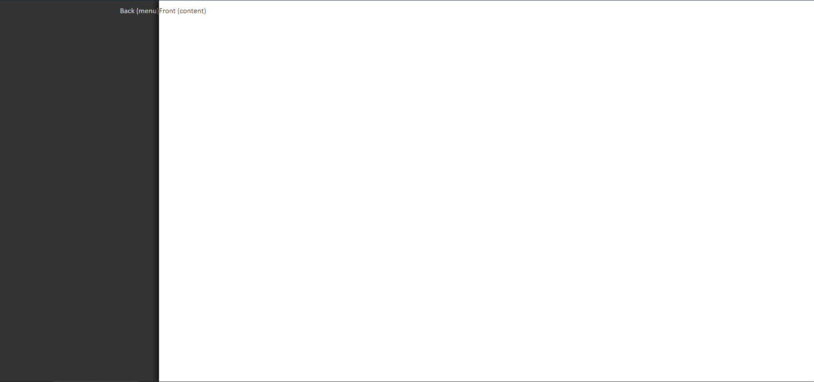

# Backwhite

Simple sophisticated styling for blogs and other content-based sites.

_Desktop View_


_Mobile Page_


_Mobile Menu_


## Installation

Just type `npm install backwhite --save` in your node project

## Usage

### Back and Front Panels

The core of this design is the back panel (appearing on the right on desktop, and appearing behind on mobile), and the front panel.

These panels are created with `<div class='bw-back'>` and `<div class='bw-front>` respectively.

```html
<body>
    <div class='bw-back'>
        <p>Back (menu)</p>
    </div>
    <div class='bw-front'>
        <p>Front (content)</p>
    </div>
</body>
```



Wrap all the content in these panels with their appropriate containers to provide spacing.

```html
<body>
    <div class='bw-back'>
        <div class='bw-back-container'>
            <p>Back (menu)</p>
        </div>
    </div>
    <div class='bw-front'>
        <div class='bw-front-container'>
            <p>Front (content)</p>
        </div>
    </div>
</body>
```


### Headers

Both the back and the front panel in the example have headers at the top. Headers have a title and a series of actions (usually icon buttons).

Backwhite comes with fontawesome solid and brand icons. Use them just like you would in any other app.

This is an example of a header in the front panel.

```html
<div class='bw-header'>
    <h1 class='bw-title'>Example Header</h1>
    <button class='bw-action'>
        <span class='fas fa-check'></span>
    </button>
    <button class="bw-action">
        <span class="fas fa-times"></span>
    </button>
</div>
```


The order of the html controls the order of the elements. This is an example of a header in the back panel.

```html
<div class='bw-header'>
    <button class="bw-action">
        <span class="fas fa-times"></span>
    </button>
    <button class='bw-action'>
        <span class='fas fa-check'></span>
    </button>
    <h1 class='bw-title'>Example Header</h1>
</div>
```


_More content will be added below soon_

### Controlling Mobile Sliding

### Back Menu Links

### Back Menu Footer

### Responsive Tables

### Cutouts

### Forms

#### Block Forms

#### Cutout Forms

#### Inline Forms

### Customization

#### Colors

#### Spacing

#### Font Scales

#### Controlling Responsiveness