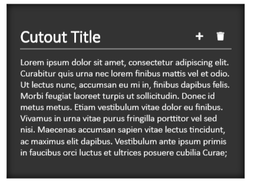
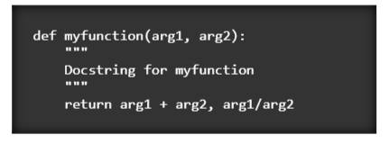

# Backwhite

Simple sophisticated styling for blogs and other content-based sites.

_Desktop View_


_Mobile Page_


_Mobile Menu_


## Installation

Just type `npm install backwhite --save` in your node project.

In your html page, import the css and js files.

```html
<head>
    <!-- ... -->

    <link rel='sylesheet' href='[path-to-module]/dist/css/backwhite.css'/>
    <script src='[path-to-module]/dist/js/backwhite.js' charset='utf-8'></script>
</head>
```

## Usage

### Back and Front Panels

The core of this design is the back panel (appearing on the right on desktop, and appearing behind on mobile), and the front panel.

These panels are created with `<div class='bw-back'>` and `<div class='bw-front'>` respectively.

```html
<body>
    <div class='bw-back'>
        <p>Back (menu)</p>
    </div>
    <div class='bw-front'>
        <p>Front (content)</p>
    </div>
</body>
```


Wrap all the content in these panels with their appropriate containers to provide spacing.

```html
<body>
    <div class='bw-back'>
        <div class='bw-back-container'>
            <p>Back (menu)</p>
        </div>
    </div>
    <div class='bw-front'>
        <div class='bw-front-container'>
            <p>Front (content)</p>
        </div>
    </div>
</body>
```


### Headers

Both the back and the front panel in the example have headers at the top. Headers have a title and a series of actions (usually icon buttons).

Backwhite comes with fontawesome solid and brand icons. Use them just like you would in any other app.

This is an example of a header in the front panel.

```html
<div class='bw-header'>
    <h1 class='bw-title'>Example Header</h1>
    <button class='bw-action'>
        <span class='fas fa-check'></span>
    </button>
    <button class="bw-action">
        <span class="fas fa-times"></span>
    </button>
</div>
```


This is an example of a header in the back panel.

```html
<div class='bw-header'>
    <button class="bw-action">
        <span class="fas fa-times"></span>
    </button>
    <button class='bw-action'>
        <span class='fas fa-check'></span>
    </button>
    <h1 class='bw-title'>Example Header</h1>
</div>
```


_More content will be added below soon_

### Controlling Mobile Sliding

The front and back usually start with main headers. These are what will contain the buttons controlling the sliding on mobile. The front panel header would usually contain the title of the page. The back panel header would contain the title of the site. On each of these there would be one button which handles opening and closing.

```html
<body>
    <div class="bw-back">
        <div class="bw-back-container">
            <div class='bw-header'>
                <button class="bw-action bw-show-on-mobile bw-close">
                    <span class="fas fa-chevron-left"></span>
                </button>
                <h1 class='bw-title'>Example Header</h1>
            </div>
        </div>
    </div>
    <div class="bw-front">
        <div class="bw-front-container">
            <div class='bw-header'>
                <h1 class='bw-title'>Example Header</h1>
                <button class="bw-action bw-show-on-mobile bw-open">
                    <span class="fas fa-chevron-right"></span>
                </button>
            </div>
        </div>
    </div>
</body>
```

_Desktop_


_Mobile Page_


_Mobile Menu_


`.bw-show-on-mobile` will hide the button on desktop and show it on mobile. `.bw-open` and `.bw-close` are preprogrammed classes which trigger the opening and closing of the menu respectively when clicked. Font awesone's chevron icons are being used here.

### Back Menu Links

Links are organized on the back menu using a table.

```html
<table class="bw-links">
    <tr>
        <td><a href='#'>About</a></td>
        <td><a href='#'>Contact</a></td>
        <td><a href='#'>Post of the Day</a></td>
    </tr>
    <tr>
        <td><a href='#'>Web Design</a></td>
        <td><a href='#'>Hardware</a></td>
        <td><a href='#'>Machine Learning</a></td>
    </tr>
    <tr>
        <td>
            <a href="#">
                <span class="fab fa-youtube"></span> Youtube
            </a>
        </td>
        <td>
            <a href="#">
                <span class="fab fa-github"></span> Github
            </a>
        </td>
        <td>
            <a href="#">
                <span class="fab fa-linkedin"></span> Linkedin
            </a>
        </td>
    </tr>
</table>
```


### Back Menu Footer

The footer goes in the back menu within a div with the class `.bw-footer`.

```html
<div class="bw-footer">
    <p>Lorem ipsum dolor sit amet, consectetur adipisicing elit, sed do 
        eiusmod tempor incididunt ut labore et dolore magna aliqua. 
        Ut enim ad minim veniam, quis nostrud exercitation ullamco 
        laboris nisi ut aliquip ex ea commodo consequat. 
        Duis aute irure dolor in reprehenderit in voluptate 
        velit esse cillum dolore eu fugiat nulla pariatur. 
        Excepteur sint occaecat cupidatat non proident, sunt in 
        culpa qui officia deserunt mollit anim id est laborum.</p>
</div>
```


### Responsive Tables

Tables are scaled so that every cell is as wide as the widest text cell. This means that the tables will overflow over the edge. In backwhite, these tables are wrapped in a horizontal scroll wrapper div to allow for horizontal scrolling between tables.

```html
<div class='bw-horiz-scroll-wrapper'>
    <table>
        <thead>
            <tr>
                <th>Name</th>
                <th>Age</th>
                <th>Town</th>
                <th>Email</th>
            </tr>
        </thead>
        <tbody>
            <tr>
                <td>Joe</td>
                <td>22</td>
                <td>Allentown</td>
                <td>joe@schmoes.goes</td>
            </tr>
            <tr>
                <td>Jim</td>
                <td>20</td>
                <td>Gainsville</td>
                <td>jim@shims.dims</td>
            </tr>
            <tr>
                <td>Steven</td>
                <td>32</td>
                <td>Birmington</td>
                <td>steven@schmultz.gultz</td>
            </tr>
        </tbody>
    </table>
</div>
```


### Cutouts

Another part that backwhite styling provides is cutouts. A cutout is a special emphasised part of the document that appears cut out from the front part, using the back as it's background.

```html
<div class="bw-cutout">
    <p>Lorem ipsum dolor sit amet, consectetur adipiscing elit. 
        Curabitur quis urna nec lorem finibus mattis vel et odio. 
        Ut lectus nunc, accumsan eu mi in, finibus dapibus felis. 
        Morbi feugiat laoreet turpis ut sollicitudin. Donec id metus 
        metus. Etiam vestibulum vitae dolor eu finibus. Vivamus in 
        urna vitae purus fringilla porttitor vel sed nisi. Maecenas 
        accumsan sapien vitae lectus tincidunt, ac maximus elit dapibus. 
        Vestibulum ante ipsum primis in faucibus orci luctus et ultrices 
        posuere cubilia Curae;</p>
</div>
```


You can add headers to cutouts as well

```html
<div class="bw-cutout">
    <div class="bw-header">
        <h3 class="bw-title">Cutout Title</h3>
        <button class="bw-action">
            <span class="fas fa-plus"></span>
        </button>
        <button class="bw-action">
            <span class="fas fa-trash"></span>
        </button>
    </div>
    <p>Lorem ipsum dolor sit amet, consectetur adipiscing elit. 
        Curabitur quis urna nec lorem finibus mattis vel et odio. 
        Ut lectus nunc, accumsan eu mi in, finibus dapibus felis. 
        Morbi feugiat laoreet turpis ut sollicitudin. Donec id metus 
        metus. Etiam vestibulum vitae dolor eu finibus. Vivamus in 
        urna vitae purus fringilla porttitor vel sed nisi. Maecenas 
        accumsan sapien vitae lectus tincidunt, ac maximus elit dapibus. 
        Vestibulum ante ipsum primis in faucibus orci luctus et ultrices 
        posuere cubilia Curae;</p>
</div>
```



Blockquotes and pre/code sections are automatically formatted as cutouts

```html
<blockquote>
    Lorem ipsum dolor sit, amet consectetur adipisicing elit. Commodi 
    officia ipsum optio illum. Sunt fugiat nemo veritatis tempora 
    voluptas ea laudantium? Explicabo ipsa error distinctio nihil 
    nostrum exercitationem hic tempora.
</blockquote>
```


```html
<pre><code>def myfunction(arg1, arg2):
    """
    Docstring for myfunction
    """
    return arg1 + arg2, arg1/arg2</code></pre>
```



### Buttons

Backwhite provides three button types. `.bw-text-button` is a button formatted simply as text. `.bw-cutout-button` is a button formatted like a cutout. Use this in a front-formatted section. For the back and cutouts, there is `.bw-raised-button`.

```html
<p><button class="bw-text-button">Text Button</button></p>
<p><button class="bw-cutout-button">Cutout Button</button></p>
<div class="bw-cutout">
    <p><button class="bw-raised-button">Raised Button</button></p>
</div>
```


### Forms

#### Block Forms

Backwhite Forms are created with the `bw-form` class.

```html
<form class='bw-form' action='...'>

</form>
```

Form entries are organized into rows (in a div called `.bw-form-row`). Each of these rows contain one or more input fields. An input field is actually a group containing a label and an input, contained in a `.bw-input-group`. This handles coupling the input and label and styling them as a single entity. Input groups are automatically scaled to fill the width of the row (using flexbox). 

```html
<div class="bw-form-row">
    <div class="bw-input-group">
        <label for="first-name">First Name:</label>
        <input type="text" name="first-name">
    </div>

    <div class="bw-input-group">
        <label for="last-name">Last Name:</label>
        <input type="text" name="last-name">
    </div>
</div>
```

`.bw-input-group` also works for selects.

```html
<div class="bw-input-group">
    <label for="race">Race:</label>
    <select name="race">
        <option disabled selected>Select...</option>
        <option value="caucasian">Caucasian</option>
        <option value="african-afam">African/African American</option>
        <option value="asian-pac">Asian/Pacific Islander</option>
    </select>
</div>
```

Checkbox and file inputs are special and use `.bw-checkbox-group` and `.bw-file-group` respectively. 

```html
<div class="bw-checkbox-group">
    <label for="hispanic-latino">Hispanic/Latino</label>
    <input type="checkbox" name="hispanic-latino">
</div>

...

<div class="bw-file-group">
    <label for="upload">Upload File:</label>
    <input type="file" name="upload">
</div>
```

At the bottom, `.bw-button-group` will contain form buttons (this should be contained in it's own `.bw-form-row`).

```html
<div class="bw-form-row">
    <div class="bw-button-group">
        <button class="bw-text-button" type="reset">Reset</button>
        <button class="bw-cutout-button" type="submit">Submit</button>
    </div>
</div>
```

Here's an example of an entire form:

```html
<h2>Form</h2>
<form class="bw-form" action="#">
    <div class="bw-form-row">
        <div class="bw-input-group">
            <label for="first-name">First Name:</label>
            <input type="text" name="first-name">
        </div>

        <div class="bw-input-group">
            <label for="last-name">Last Name:</label>
            <input type="text" name="last-name">
        </div>
    </div>

    <div class="bw-form-row">
        <div class="bw-input-group">
            <label for="email">Email:</label>
            <input type="email" name="email">
        </div>
    </div>

    <div class="bw-form-row">
        <div class="bw-input-group">
            <label for="password">Password:</label>
            <input type="password" name="password">
        </div>

        <div class="bw-input-group">
            <label for="verify">Verify Password:</label>
            <input type="password" name="verify">
        </div>
    </div>

    <div class="bw-form-row">
        <div class="bw-input-group">
            <label for="age">Age:</label>
            <input type="number" name="age">
        </div>

        <div class="bw-input-group">
            <label for="gender">Gender:</label>
            <select name="gender">
                <option disabled selected>Select...</option>
                <option value="male">Male</option>
                <option value="female">Female</option>
                <option value="nonbinary">Non-Binary</option>
            </select>
        </div>
    </div>

    <div class="bw-form-row">
        <div class="bw-input-group">
            <label for="race">Race:</label>
            <select name="race">
                <option disabled selected>Select...</option>
                <option value="caucasian">Caucasian</option>
                <option value="african-afam">African/African American</option>
                <option value="asian-pac">Asian/Pacific Islander</option>
            </select>
        </div>

        <div class="bw-checkbox-group">
            <label for="hispanic-latino">Hispanic/Latino</label>
            <input type="checkbox" name="hispanic-latino">
        </div>
    </div>

    <div class="bw-form-row">
        <div class="bw-checkbox-group">
            <label for="active-veteran">Active Military or Veteran</label>
            <input type="checkbox" name="active-veteran">
        </div>
    </div>

    <div class="bw-form-row">
        <div class="bw-file-group">
            <label for="upload">Upload File:</label>
            <input type="file" name="upload">
        </div>
    </div>

    <div class="bw-form-row">
        <div class="bw-button-group">
            <button class="bw-text-button" type="reset">Reset</button>
            <button class="bw-cutout-button" type="submit">Submit</button>
        </div>
    </div>
</form>
```


#### Cutout Forms

You can also make a form in a cutout. Remember to use `.bw-raised-button` in this form in place of `.bw-cutout-button`.

```html
<div class="bw-cutout">
    <div class="bw-header">
        <h3 class="bw-title">Cutout Form</h3>
    </div>

    <form class="bw-form" action="#">
        <div class="bw-form-row">
            <div class="bw-input-group">
                <label for="first-name">First Name:</label>
                <input type="text" name="first-name">
            </div>

            <div class="bw-input-group">
                <label for="last-name">Last Name:</label>
                <input type="text" name="last-name">
            </div>
        </div>

        <div class="bw-form-row">
            <div class="bw-input-group">
                <label for="email">Email:</label>
                <input type="email" name="email">
            </div>
        </div>

        <div class="bw-form-row">
            <div class="bw-input-group">
                <label for="password">Password:</label>
                <input type="password" name="password">
            </div>

            <div class="bw-input-group">
                <label for="verify">Verify Password:</label>
                <input type="password" name="verify">
            </div>
        </div>

        <div class="bw-form-row">
            <div class="bw-input-group">
                <label for="age">Age:</label>
                <input type="number" name="age">
            </div>

            <div class="bw-input-group">
                <label for="gender">Gender:</label>
                <select name="gender">
                    <option disabled selected>Select...</option>
                    <option value="male">Male</option>
                    <option value="female">Female</option>
                    <option value="nonbinary">Non-Binary</option>
                </select>
            </div>
        </div>

        <div class="bw-form-row">
            <div class="bw-input-group">
                <label for="race">Race:</label>
                <select name="race">
                    <option disabled selected>Select...</option>
                    <option value="caucasian">Caucasian</option>
                    <option value="african-afam">African/African American</option>
                    <option value="asian-pac">Asian/Pacific Islander</option>
                </select>
            </div>

            <div class="bw-checkbox-group">
                <label for="hispanic-latino">Hispanic/Latino</label>
                <input type="checkbox" name="hispanic-latino">
            </div>
        </div>

        <div class="bw-form-row">
            <div class="bw-checkbox-group">
                <label for="active-veteran">Active Military or Veteran</label>
                <input type="checkbox" name="active-veteran">
            </div>
        </div>

        <div class="bw-form-row">
            <div class="bw-file-group">
                <label for="upload">Upload File:</label>
                <input type="file" name="upload">
            </div>
        </div>

        <div class="bw-form-row">
            <div class="bw-button-group">
                <button class="bw-text-button" type="reset">Reset</button>
                <button class="bw-raised-button" type="submit">Submit</button>
            </div>
        </div>
    </form>
</div>
```


#### Inline Forms

Forms can also take up one row. These are created by `.bw-inline-form`. Buttons in this form are automatically pushed to the right (or left depending on ordering) and are automatically formatted. For example, a search bar:

```html
<form class="bw-inline-form" action="#">
    <div class="bw-input-group">
        <label for="q">Search</label>
        <input type="text" name="q">
    </div>
    <div class="bw-button-group">
        <button type="submit">
            <span class="fas fa-search"></span>
                Search
        </button>
    </div>
</form>
```


### Customization

#### Colors

#### Spacing

#### Font Scales

#### Controlling Responsiveness